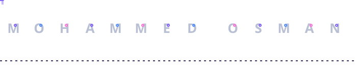

A little easter egg — the runner hops the name on loop, no interaction needed. Lives at <code>assets/name-runner.svg</code>, plain SVG, no JavaScript.

 

Design should feel expensive. Systems should feel invisible. Technology should feel cinematic.

I build end-to-end web and mobile products out of Nairobi, Kenya — from backend architecture to the motion and polish that makes an interface feel finished.

 

### Expertise

| Domain | Focus |
|---|---|
| Software engineering | End-to-end web and mobile systems |
| Interface engineering | Motion-rich, premium UI |
| Cloud and DevOps | Scalable infrastructure, Docker, Linux |
| AI-powered applications | Intelligent, automated digital products |
| Real estate media | Drone footage, 360° tours, immersive platforms |
| Cinematic content | Video editing, brand identity, YouTube |

 

### Tech stack

**Frontend**

**Backend & APIs**

Laravel + Blade also drive server-rendered views, so PHP shows up on the front-facing side of the stack too.

**Databases**

**DevOps & Infrastructure**

 

### Currently building

| Project | Status |
|---|---|
| AI-powered website systems | In progress |
| Smart water delivery platform | In progress |
| Advanced dashboard architecture | In progress |
| Modern SaaS-style client systems | In progress |
| Premium UI motion systems with GSAP | In progress |
| Website-to-HTML conversion tools | In progress |

 

### Currently learning

- AI infrastructure and automation systems
- Advanced DevOps and CI/CD pipelines
- Scalable backend architecture
- High-performance frontend systems
- Quantum computing concepts, out of curiosity

 

### Beyond the codebase

Professional photography, cinematic video editing, drone production, YouTube content, and premium brand identity systems.

 

### GitHub activity

The two cards above are generated by a free public service (github-readme-stats.vercel.app) that gets paused by its own maintainer from time to time — if they show broken, it's a known outage on their end, not a config problem here. They tend to come back on their own; self-hosting a personal copy on Vercel is the permanent fix if it keeps happening.

  

**Contribution snake** — a live-updating animation that eats through the graph above, regenerated automatically every few hours by GitHub Actions.

<picture>
  <source media="(prefers-color-scheme: dark)" srcset="https://raw.githubusercontent.com/Mohammedismail-cyber/Mohammedismail-cyber/output/github-snake-dark.svg">
  <source media="(prefers-color-scheme: light)" srcset="https://raw.githubusercontent.com/Mohammedismail-cyber/Mohammedismail-cyber/output/github-snake.svg">
  
</picture>

This won't render until the workflow below has run once on your repo — see setup notes at the bottom.

 

### Showcase reel

<!--
  Reserve this spot for an actual video walkthrough of your work.
  GitHub only embeds a *playable* video when it's uploaded through the README
  editor on github.com itself (drag a .mp4/.mov file into the text box while
  editing this file there). That upload gives you a github.com/user-attachments/...
  link with a working <video> tag. Paste that block in here once you have it, e.g.:

  <video src="https://github.com/user-attachments/assets/your-generated-id" controls width="100%"></video>
-->

A short reel of live product builds, motion work, and drone footage is coming — drop it in above once it's uploaded through GitHub's editor for a real inline player.

 

<picture>
  <source media="(prefers-color-scheme: dark)" srcset="https://readme-typing-svg.demolab.com?font=Sora&weight=400&size=16&duration=2600&pause=1000&color=C7B9FF&center=true&vCenter=true&repeat=true&width=560&height=40&lines=Open+to+collaborations;Based+in+Nairobi%2C+Kenya;Turning+ideas+into+shipped+products">
  
</picture>

<!--
  SETUP NOTES — delete once done
  1. This README lives in your special profile repo: github.com/Mohammedismail-cyber/Mohammedismail-cyber
  2. Add the included name-runner.svg to assets/name-runner.svg in that repo — the hero
     section above points to it with a relative path, so it just needs to exist there.
  3. To light up the contribution snake:
     - Add the included snake.yml to .github/workflows/snake.yml in that repo
     - Settings > Actions > General > Workflow permissions > set to "Read and write"
     - Run the workflow once from the Actions tab (or push a commit)
     - It creates an "output" branch with the generated svg files the image tags above point to
  4. Swap in real links wherever you want contact badges (LinkedIn, email, portfolio) —
     kept out of this version since none were provided.
-->
